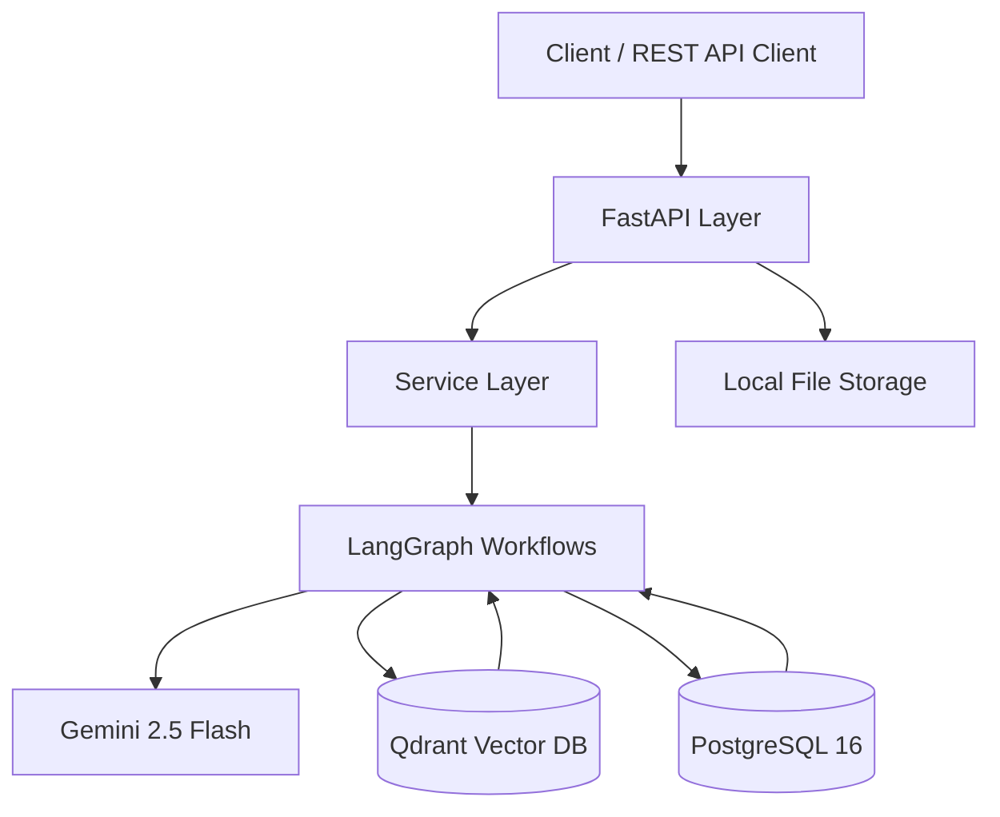
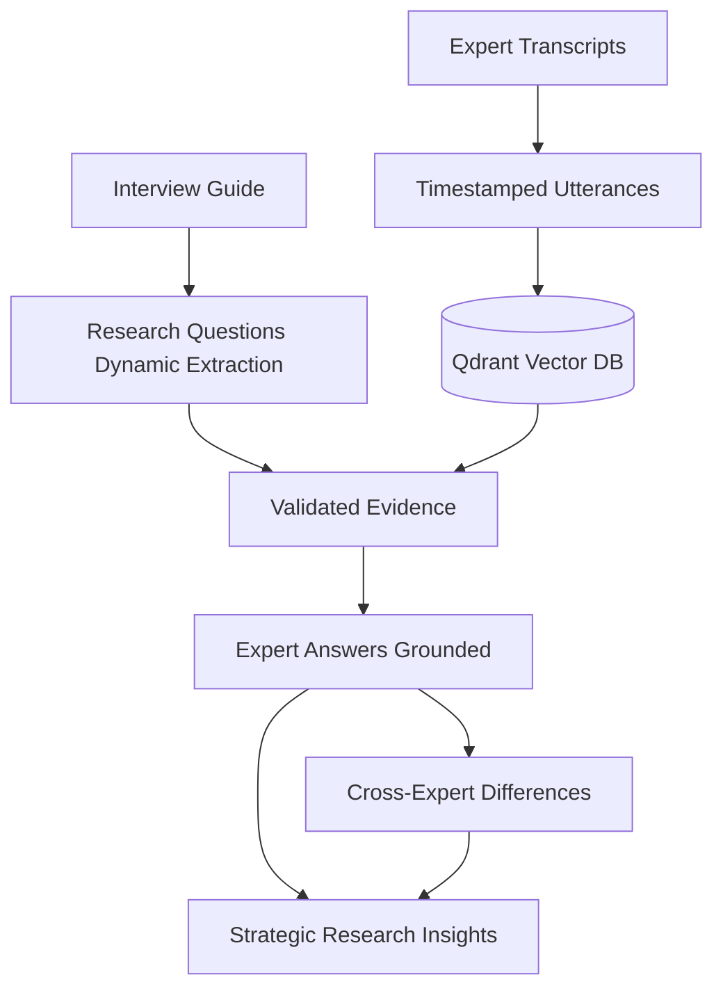
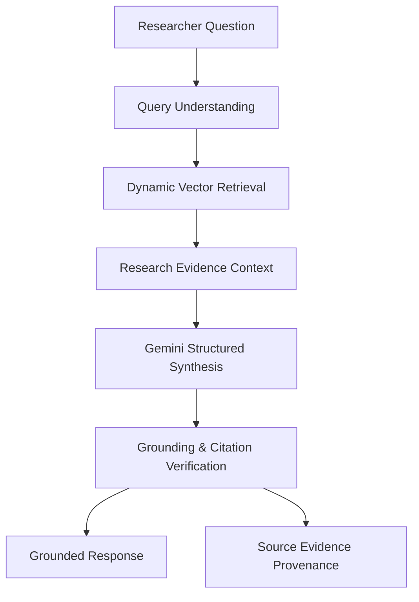

# InsightOS — Qualitative Research Intelligence Platform (V1)

**InsightOS** is an AI-powered qualitative research intelligence platform designed to extract, analyze, compare, and synthesize insights from expert interview transcripts and interview guides with **strict, unbreakable provenance and anti-hallucination guarantees**.

---

## 1. Core Principles

> **THE LLM CAN INTERPRET EVIDENCE. THE LLM MUST NOT MANUFACTURE EVIDENCE.**

Every important Answer, Difference, Strategic Insight, and Copilot response generated by InsightOS is grounded in and traceable back to actual transcript utterances:

```
Research Question
       ↓
Answer / Difference / Insight / Copilot
       ↓
Validated Evidence
       ↓
Canonical Utterance
       ↓
Transcript & Timestamp Range
       ↓
Expert Metadata
```

---

## 2. System Architecture

InsightOS is built as a modular monolith:



---

## 3. End-to-End Qualitative Research Pipeline



---

## 4. Research Copilot Flow

The Research Copilot allows researchers to ask arbitrary exploratory questions across the entire project knowledge base:



---

## 5. Technology Stack

- **Backend:** Python 3.12+, FastAPI, Pydantic v2, SQLAlchemy 2.x, asyncpg, Alembic
- **AI Orchestration & Models:** LangGraph, Google Gemini 2.5 Flash, Gemini Embeddings (`gemini-embedding-exp-03-07`)
- **Vector Database:** Qdrant (cosine similarity, filtered payload search)
- **Database:** PostgreSQL 16 (UUID primary keys, timezone-aware UTC timestamps)
- **Storage:** Local filesystem abstraction with path-traversal protection
- **Containerization:** Docker & Docker Compose
- **Testing:** pytest, pytest-asyncio, httpx, aiosqlite

---

## 6. Repository Structure

```
backend/
├── app/
│   ├── main.py                     # FastAPI application entry point & lifespan
│   ├── api/
│   │   └── v1/
│   │       ├── router.py           # V1 route aggregator
│   │       ├── projects.py         # Project CRUD endpoints
│   │       ├── guides.py           # Guide upload & question extraction
│   │       ├── experts.py          # Expert registration
│   │       ├── transcripts.py      # Transcript parsing & vector ingestion
│   │       ├── analysis.py         # Full research pipeline execution
│   │       ├── evidence.py         # Traceable evidence endpoints
│   │       ├── differences.py      # Cross-expert comparisons
│   │       ├── insights.py         # Strategic project insights
│   │       ├── copilot.py          # Research Copilot inquiry endpoint
│   │       └── health.py           # Health check endpoint
│   ├── models/                     # SQLAlchemy 2.x ORM models
│   │   ├── project.py
│   │   ├── guide.py
│   │   ├── question.py
│   │   ├── expert.py
│   │   ├── transcript.py
│   │   ├── utterance.py            # Primary source-of-truth entity
│   │   ├── evidence.py             # Grounded evidence & association tables
│   │   ├── answer.py
│   │   ├── difference.py
│   │   └── insight.py
│   ├── schemas/                    # Pydantic v2 API schemas
│   ├── services/                   # Business logic service layer
│   ├── graphs/                     # LangGraph AI workflows
│   │   ├── evidence_graph.py       # Candidate retrieval & LLM classification
│   │   ├── answer_graph.py         # Grounded answer generation & ref validation
│   │   ├── difference_graph.py     # Cross-expert divergence analysis
│   │   ├── insight_graph.py        # Macro insight synthesis
│   │   └── copilot_graph.py        # Copilot dynamic retrieval & synthesis
│   ├── ai/
│   │   ├── client.py               # Abstract LLM client
│   │   ├── gemini.py               # Gemini 2.5 Flash implementation
│   │   ├── prompts/                # Dedicated versioned prompt templates
│   │   └── schemas/                # LLM structured output models
│   ├── retrieval/
│   │   ├── embeddings.py           # Embedding service abstraction
│   │   ├── qdrant.py               # Qdrant client & collection management
│   │   └── search.py               # Semantic search service
│   ├── parsers/
│   │   ├── guide_parser.py         # Text & PDF guide parser
│   │   └── transcript_parser.py    # Multi-format timestamped transcript parser
│   ├── storage/
│   │   └── local.py                # LocalStorage abstraction
│   ├── db/
│   │   ├── base.py                 # DeclarativeBase
│   │   └── session.py              # Async SQLAlchemy session factory
│   └── core/
│       ├── config.py               # Pydantic BaseSettings
│       ├── logging.py              # JSON structured contextual logging
│       ├── enums.py                # Status enums
│       └── exceptions.py           # Application exception hierarchy
├── alembic/                        # Async database migrations
│   ├── versions/
│   │   └── 001_initial_schema.py   # Complete initial table definitions
│   └── env.py
├── tests/                          # Automated test suite
│   ├── conftest.py                 # In-memory SQLite & mock fixtures
│   ├── test_parsers.py             # Parser unit tests
│   ├── test_storage.py             # Storage & security tests
│   ├── test_isolation.py           # Multi-project isolation tests
│   ├── test_evidence_validation.py # Anti-hallucination validation tests
│   ├── test_api.py                 # API endpoints tests
│   └── test_vertical_slice.py      # End-to-end user journey test
├── Dockerfile
├── docker-compose.yml
├── requirements.txt
├── pyproject.toml
├── .env.example
└── README.md
```

---

## 7. Quickstart & Setup

### Prerequisites
- Docker & Docker Compose OR Python 3.12+ with PostgreSQL and Qdrant running locally
- Google Gemini API Key

### Step 1: Clone and Configure Environment
```bash
cp .env.example .env
```
Edit `.env` and insert your Gemini API Key:
```env
GEMINI_API_KEY=your_actual_api_key
```

### Step 2: Run with Docker Compose
Start PostgreSQL, Qdrant, and the Backend with automatic migration execution:
```bash
docker compose up --build
```
The API will be live at `http://localhost:8000`.
Interactive API documentation is available at `http://localhost:8000/docs`.

### Step 3: Run Locally (Without Docker)
```bash
# 1. Install dependencies
pip install -r requirements.txt

# 2. Run migrations
alembic upgrade head

# 3. Start development server
uvicorn app.main:app --host 0.0.0.0 --port 8000 --reload
```

---

## 8. Step-by-Step API Usage Guide

### 1. Create a Research Project
`POST /api/v1/projects`
```json
{
  "name": "Robotic Surgery Adoption Study",
  "objective": "Evaluate capital budget bottlenecks and surgeon learning curves across Europe."
}
```
*Response (`201 Created`):*
```json
{
  "id": "3fa85f64-5717-4562-b3fc-2c963f66afa6",
  "name": "Robotic Surgery Adoption Study",
  "objective": "Evaluate capital budget bottlenecks and surgeon learning curves across Europe.",
  "status": "pending",
  "created_at": "2026-09-24T12:00:00Z",
  "updated_at": "2026-09-24T12:00:00Z"
}
```

### 2. Upload Interview Guide
`POST /api/v1/projects/{project_id}/guide` (multipart/form-data with file)
Gemini automatically analyzes the guide and extracts all research questions dynamically.

*Response:*
```json
{
  "total": 2,
  "questions": [
    {
      "id": "7b13e9a1-4321-4f11-8899-0123456789ab",
      "project_id": "3fa85f64-5717-4562-b3fc-2c963f66afa6",
      "question_number": 1,
      "question_text": "What are the primary clinical workflows and adoption barriers?",
      "category": "Clinical Workflow",
      "created_at": "2026-09-24T12:01:00Z"
    }
  ]
}
```

### 3. Create Expert Interviewee
`POST /api/v1/projects/{project_id}/experts`
```json
{
  "name": "Dr. Sarah Jenkins",
  "role": "Chief of Surgery",
  "market": "UK",
  "organization": "Imperial College Healthcare"
}
```

### 4. Upload Expert Transcript
`POST /api/v1/projects/{project_id}/transcripts` (form data with `expert_id` and file)
The backend automatically:
- Parses utterances with start/end timestamps
- Stores utterances in PostgreSQL as the canonical ground truth
- Computes vector embeddings
- Upserts points into Qdrant with project-scoped metadata

### 5. Run Full Analysis Pipeline
`POST /api/v1/projects/{project_id}/analysis`
Executes the LangGraph pipeline across all questions and experts:
- Evaluates candidate utterances for evidence relevance
- Synthesizes grounded answers with strict evidence citations
- Compares perspectives across experts for divergences
- Generates strategic project-level insights

### 6. Ask the Research Copilot
`POST /api/v1/projects/{project_id}/ask`
```json
{
  "question": "What did the UK expert say regarding nurse training timelines?"
}
```

*Response:*
```json
{
  "answer": "The UK expert noted that nurse cross-training was the primary workflow bottleneck, requiring three weeks of scheduled dry-runs before deployment.",
  "insufficient_evidence": false,
  "evidence": [
    {
      "id": "e4b50c18-9311-4045-8123-112233445566",
      "quote": "Our primary workflow barrier was nursing staff cross-training, which required three weeks of scheduled dry-runs.",
      "topic": "Clinical Workflow",
      "relevance_score": 0.96,
      "expert": {
        "id": "8c123456-789a-bcde-f012-3456789abcde",
        "name": "Dr. Sarah Jenkins"
      },
      "transcript": {
        "id": "9d234567-89ab-cdef-0123-456789abcdef",
        "file_name": "uk_transcript.txt"
      },
      "timestamp": {
        "start": "00:02:45",
        "end": "00:03:20"
      },
      "created_at": "2026-09-24T12:05:00Z"
    }
  ]
}
```

---

## 9. Running Tests

The test suite includes parser unit tests, database constraints and isolation tests, evidence anti-hallucination verification, API integration tests, and a complete vertical slice:

```bash
pytest -v
```

---

## 10. Multi-Project Isolation Guarantees

Every retrieval and database operation is strictly scoped by `project_id`:
1. **Qdrant Vector Searches:** Every search query enforces a `Must` match filter on `payload.project_id`.
2. **Database Queries:** Foreign keys enforce cascading deletions, preventing orphaned cross-project records.
3. **Traceability:** Any evidence item must belong to the active project; attempting to reference foreign evidence is rejected by the validation graph.

---

## 11. Scaling Path & Future Roadmap

V1 is intentionally structured as a clean modular monolith. Future enhancements can be added seamlessly:
- **Async Task Queue:** Move long-running analysis to Celery / Redis or Temporal without modifying the service domain layer.
- **Cloud Object Storage:** Swap `LocalStorage` with an S3 / GCS storage provider implementing the same interface.
- **Automated Theme Discovery:** Unsupervised clustering over Qdrant utterance embeddings.
- **Frontend:** Next.js / React interactive dashboard consuming `/api/v1` REST endpoints.
